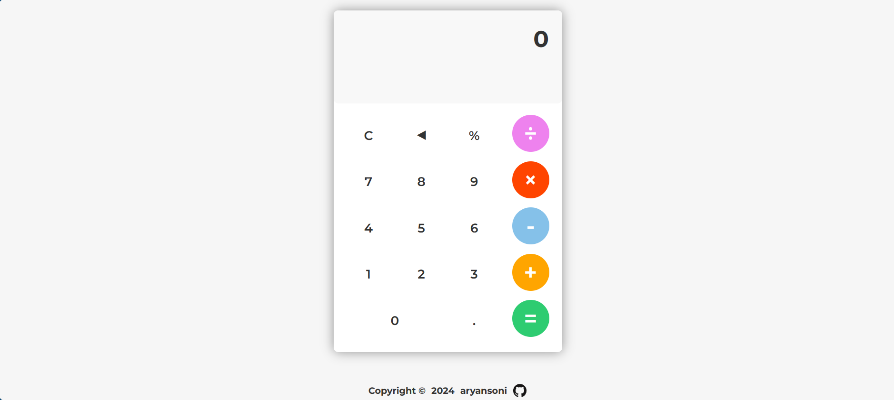

# Calculator 🧠 𝞹



You can try the calculator live [here](https://aryansoni-git.github.io/odin-calculator/)!

## Description

This Simple Calculator is a JavaScript project developed as part of the Odin Project's JavaScript Foundation course curriculum. It provides basic arithmetic operations such as addition, subtraction, multiplication, and division, allowing users to perform calculations easily. The calculator features a user-friendly interface with on-screen buttons for input and real-time display of input history and calculation results.


## Table of Contents

| Section              |
| --------------------|
| [Demo](#demo)        |
| [Features](#features)|
| [How to Use](#how-to-use) |
| [Installation](#installation) |
| [Contributing](#contributing) |
| [Contact](#contact)  |
| [Acknowledgements](#acknowledgements) |
| [License](#license)  |

## Features

- Basic arithmetic operations: addition, subtraction, multiplication, division.
- Support for the percentage (%) operator.
- Keyboard support for enhanced user experience.
- Clear button to reset the calculator.
- Real-time display of input history and calculation result.

## How to Use

1. Enter numbers using the on-screen keypad or your computer keyboard.
2. Use the buttons for arithmetic operations (+, -, *, /, %).
3. Press Enter or click the "=" button to evaluate the expression.
4. Use the "C" button to clear the input and result.
5. Enjoy performing calculations effortlessly!

## Installation

There's no need for installation. Simply download or clone the repository to your local machine and open the `index.html` file in a web browser.

```bash
git clone https://github.com/aryansoni-git/odin-calculator
```
## Navigate to the project directory:

```bash
cd odin-calculator
```

## Contributing

Contributions are welcome! If you'd like to contribute to this project, please follow these steps:

1. Fork the repository.
2. Create a new branch (`git checkout -b feature/new-feature`).
3. Make your changes.
4. Commit your changes (`git commit -am 'Add new feature'`).
5. Push to the branch (`git push origin feature/new-feature`).
6. Create a new Pull Request.

## Contact

If you have any questions or suggestions regarding this project, feel free to contact me:

| Platform | Link |
| --- | --- |
| Email | [](mailto:aryansoni.work@gmail.com) |
| GitHub | [](https://github.com/aryansoni-git) |
| Twitter | [](https://twitter.com/aryansoni_x) |
| LinkedIn | [](https://www.linkedin.com/in/aryansoni-work) |
| Instagram | [aryansoni.ig](https://www.instagram.com/aryansoni.ig/) |

## Acknowledgements

- Special thanks to [The Odin Project](https://www.theodinproject.com/) for providing the educational resources and project idea that inspired this Etch-a-Sketch implementation.
- Thanks to [Google Fonts](https://fonts.google.com/specimen/Montserrat?query=Mon) for providing the Montserrat font, which was used in this project.

